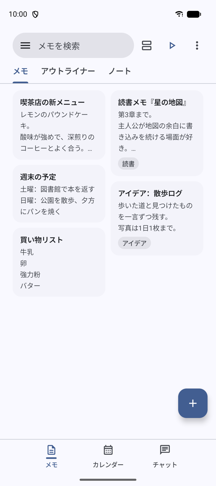
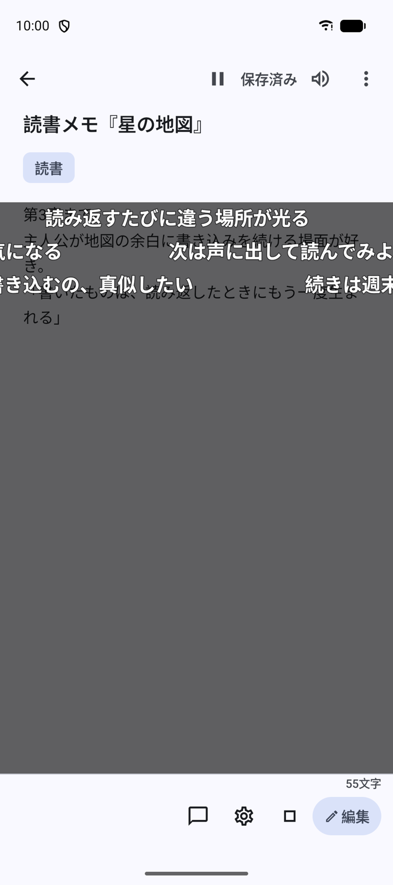
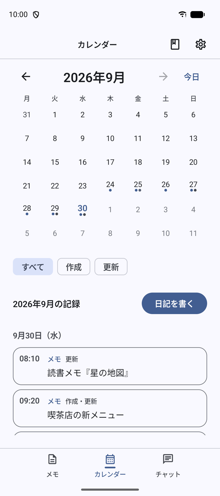
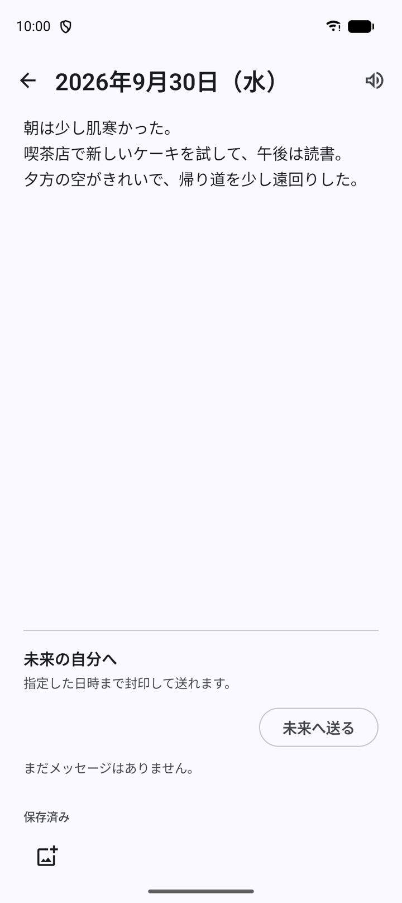
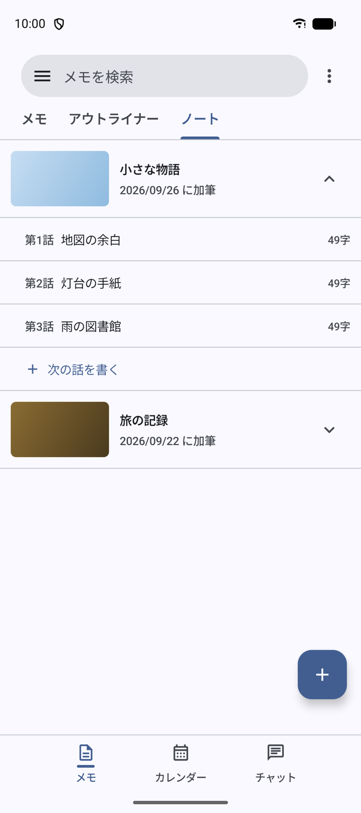
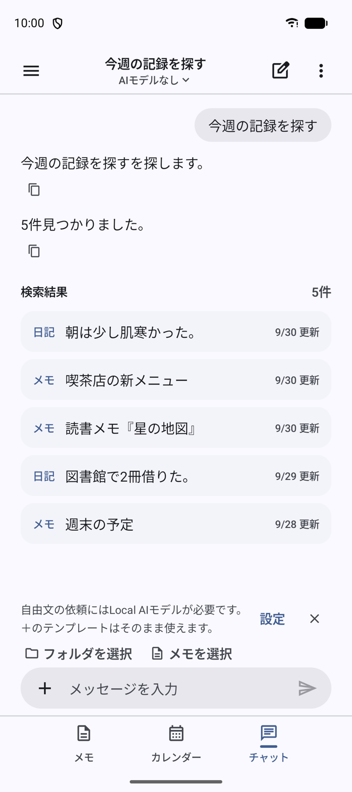

# MemoRipple OSS

MemoRipple is an Android app for writing things down and reading them again:

- **notes**, outlines and **notebooks**
- a **diary** with a calendar
- **flowing comments** — your comments drift across the page as you reread
- **text-to-speech** for memos and comments
- **overlay comments** above other apps
- optional **Google Drive backup**
- an on-device **Local AI chat**, plus templates that work without AI

**Principles:** local-first · no ads · no analytics · Local AI runs on the
device · no GGUF model is bundled · Google Drive is optional · source code under
the [Apache License 2.0](LICENSE) · the official MemoRipple branding is **not**
part of that license ([BRANDING.md](BRANDING.md)).

The current public snapshot uses a Japanese UI.

MemoRipple（メモリップル）は、メモ・日記・ノートを書き、読み返した自分のコメントを画面に流せる
Android アプリです。このリポジトリはそのソースコードです。

## Why MemoRipple?

- **Built for rereading.** What you wrote is meant to come back to you — the
  calendar shows each day's records, and past entries resurface on the same day.
- **Flowing comments change how you reread.** Comments on a memo drift across
  the page like a live commentary, on the reading page, a stage, or an overlay.
- **One app for memos, a diary and notebooks.** Quick notes, outlines, a daily
  diary and long-form notebooks of episodes live side by side, with folders and
  tags.
- **Local AI on the device.** Ask in plain words, or use templates. Nothing is
  sent to a server for AI, and every change the AI proposes waits for your
  confirmation.
- **A base you can fork.** The code is Apache-2.0, so you can build a different
  app on it — for example notes + AI, calendar + AI, diary + AI, a writing tool
  + AI, or a task manager + AI.

> These are examples of what a fork could become. They are not announcements of
> future features of the official MemoRipple app.

## Screenshots

<table>
  <tr>
    <td width="50%" align="center"><br>Memo list</td>
    <td width="50%" align="center"><br>Flowing comments</td>
  </tr>
  <tr>
    <td width="50%" align="center"><br>Calendar</td>
    <td width="50%" align="center"><br>Diary</td>
  </tr>
  <tr>
    <td width="50%" align="center"><br>Notebook</td>
    <td width="50%" align="center"><br>Chat (template, no AI model)</td>
  </tr>
</table>

Screenshots of a debug build of this repository on the Android emulator, with
fictional sample data. The chat shows a built-in search template, which works
without any AI model; free-text requests use the optional Local AI.

## Build

### 1. Clone

```bash
git clone https://github.com/crag-kakao/MemoRipple-OSS.git
cd MemoRipple-OSS
```

### 2. Initialize the submodule

```bash
git submodule update --init
```

This fetches [llama.cpp](https://github.com/ggml-org/llama.cpp) at the pinned
commit into `llmbench/src/main/cpp/llama.cpp`. The app's native Local AI library
is compiled from it.

### 3. Requirements

- Android Studio (a recent stable version), or the command line
- JDK 17 or newer
- Android SDK with platform 36
- Android NDK `29.0.14206865` and CMake `3.31.6` (install both from the SDK
  Manager; the build names these exact versions)

Point Gradle at your SDK with `ANDROID_HOME`, or with a `local.properties` file
containing `sdk.dir=...` (that file is machine-local and git-ignored).

The app targets **arm64-v8a** devices running Android 10 (API 29) or newer.
Local AI also needs a CPU with the ARMv8.2 dot-product extension; on other
devices everything else works and Local AI is shown as unavailable.

### 4. Build the debug app

```bash
./gradlew :app:assembleDebug
```

Other useful tasks:

```bash
./gradlew :app:testDebugUnitTest   # unit tests
./gradlew :app:lintDebug           # lint
./gradlew :app:assembleRelease     # unsigned release build (R8 on)
```

The instrumentation tests need a device or an emulator; see
`docs/TEST_INFRASTRUCTURE.md`.

### 5. Release signing (optional)

Release builds are signed only when all four of these environment variables are
set in the shell that runs Gradle:

```
MEMORIPPLE_UPLOAD_STORE_FILE
MEMORIPPLE_UPLOAD_STORE_PASSWORD
MEMORIPPLE_UPLOAD_KEY_ALIAS
MEMORIPPLE_UPLOAD_KEY_PASSWORD
```

Without them the release artifact is left **unsigned** — there is deliberately
no fallback to the debug key. `./gradlew :app:verifyReleaseSigning` reports
whether signing is configured, without printing any value. Use your own key;
never commit a keystore or a password.

### 6. Google Drive and OAuth

Drive backup uses Google's Identity `AuthorizationClient` with the Drive
**appData** scope. The repository contains **no OAuth client ID and no client
secret**: Google recognises the app by its **package name and signing
certificate**, through an *Android* OAuth client registered for exactly that
pair in a Google Cloud project.

- The official OAuth configuration does not work for your build — your package
  name and certificate differ.
- To use Drive backup, create your own Google Cloud project, enable the Google
  Drive API, configure the OAuth consent screen, and create an Android OAuth
  client for your applicationId and the SHA-1 of each certificate you sign with
  (debug, release, and Play App Signing if you publish on Google Play).
- Drive's appData folder is private to each Cloud project, so **backups made by
  the official MemoRipple app are not visible to a fork**, and the other way
  round. Use the local backup file or the portable export to move data.

Without an OAuth client the app builds and runs normally; only Drive backup
cannot be authorized.

### 7. Local AI models

No model file is in this repository or in the app. In the app, the user can
download a model from Hugging Face: the catalog
(`app/src/main/java/io/github/cragcoffee/memoripple/data/ai/models/ModelCatalog.kt`)
pins each model to a fixed revision and verifies the file by SHA-256 before it is
used. Each model keeps its own license. The chat and its templates work without
any model.

`llmbench/` and `tools/llm-eval/` are a non-shipping evaluation harness for local
models. They join the build only with `-PllmBench=true`.

## Forking

You are free to fork this code and publish your own app under the Apache
License 2.0. **The official MemoRipple branding is not granted under
Apache-2.0** — see [BRANDING.md](BRANDING.md). Before you publish, change:

1. **applicationId** in `app/build.gradle.kts` — `io.github.cragcoffee.memoripple`
   belongs to the official app.
2. **App name** — `app_name` in `app/src/main/res/values/strings.xml`, and the
   name where it appears in the UI.
3. **Icon and logo** — the icons in this repository are neutral placeholders;
   replace them with your own artwork.
4. **Signing key** — your own upload / release key (see *Release signing*).
5. **Google OAuth configuration** — your own Google Cloud project and Android
   OAuth client (see *Google Drive and OAuth*).

The Kotlin `namespace` does not have to change for a first fork; you can change
it later if you want to.

## Licensing

- **Source code:** Apache License 2.0 — [LICENSE](LICENSE)
- **Official MemoRipple branding** (name, logos, icons, artwork): separate
  terms, All Rights Reserved — [BRANDING.md](BRANDING.md)
- **Third-party components:** their respective licenses — [NOTICE](NOTICE)

## Development notes

`docs/` holds the design notes written while the app was developed —
architecture, data model migrations, the Local AI safety pipeline, the chat and
templates, and the test infrastructure. They describe decisions as they were
made.

Some source comments and design notes still refer to the private development
history this public snapshot was taken from — for example `HANDOFF §16.29` —
and to internal notes that are not published. Those references are left as
they were; the code and the published design notes are complete without them.

Contact: cragcoffee96@gmail.com
